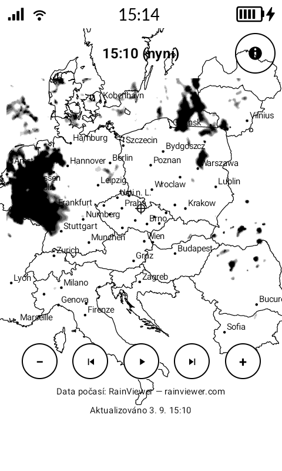

# kRadar


A single-screen **precipitation radar** for the [Mudita Kompakt](https://mudita.com/)
e-ink phone (MuditaOS-K, AOSP, **no Google Services**). It overlays
[RainViewer](https://www.rainviewer.com/) radar imagery on a static
vector map (country borders + cities), centered on your current GPS position,
with a ~2 hour animated history and +/- zoom. Coverage is **worldwide** —
RainViewer's radar network spans 80+ countries and the vector base map is global.



*Running on the Mudita Kompakt (800×480 e-ink).*

[](https://www.buymeacoffee.com/ok1cdj)

## What it does

- Centers on your location using AOSP `LocationManager` (GPS, then network) —
  **not** FusedLocationProviderClient, which needs Play Services.
- Downloads RainViewer's "widget" tiles (Web Mercator, centered on lat/lon) for
  every past frame at once, quantizes each to discrete grey intensity levels for
  e-ink, then animates them in memory (no network during playback).
- Appends RainViewer's 30-minute **nowcast** forecast frames after the live
  radar. The app opens on the current frame ("now"), and forecast frames are
  marked with a solid ▲ next to the time so a prediction reads as distinct from
  real radar.
- Draws borders + cities as a static vector layer using the **same Web Mercator
  projection** as the tiles, so map and radar stay aligned at every zoom. Cities
  are revealed progressively — only major cities at low zoom, more towns as you
  zoom in (each carries a `minZoom`).
- Shows the mandatory "Weather data by RainViewer" attribution on screen.
- Auto-refreshes the radar frames and re-reads GPS every time the app returns to
  the foreground (throttled to once per 10 min); zooming forces an immediate
  reload.

## Data source & attribution

- Radar: **RainViewer Weather Maps API** — free for personal use, no API key.
  Attribution "Weather data by RainViewer" is displayed in-app (required).
  <https://www.rainviewer.com/api/weather-maps-api.html>
- Base map data is **Natural Earth** (public domain): borders from
  `ne_50m_admin_0_countries`, cities from `ne_10m_populated_places`. An optional
  curated Czech city overlay comes from the **MeteoPlaneRadar** project.

## Map data (regenerating the assets)

`app/src/main/assets/{borders.json,cities.json}` are generated by
`tools/convert_mapdata.py`, which downloads the Natural Earth GeoJSON it needs to
a local cache (`tools/.ne_cache/`, git-ignored) on first run:

```bash
python3 tools/convert_mapdata.py
```

If the sibling `MeteoPlaneRadar` checkout is present, its curated Czech city list
replaces the global cities inside the CZ bounding box (nicer local names/abbrs
like PHA, OVA, PLZ). It's optional — without it the tool emits global-only cities:

```bash
# point at a different checkout (or omit entirely to skip the Czech overlay):
METEOPLANE_SRC=/path/to/MeteoPlaneRadar/src python3 tools/convert_mapdata.py
```

- `borders.json` — `[[[lat,lon], ...], ...]` (one array per country ring).
- `cities.json`  — `[{"name","abbr","lat","lon","minZoom"}, ...]`. `minZoom` is the
  lowest map zoom (4–7) at which the city appears; it's derived from Natural
  Earth's `SCALERANK`, with capitals/megacities promoted so they show earlier.

## Build & install

Requires JDK 17+ (the Android Studio JBR works). The Android SDK path goes in
`local.properties` (copy from `local.properties.example`).

```bash
export JAVA_HOME=/opt/android-studio/jbr     # or any JDK 17+
./gradlew assembleDebug                       # app/build/outputs/apk/debug/app-debug.apk
./gradlew assembleRelease                     # signed release (needs keystore in local.properties)
```

Sideload the APK via **Mudita Center** (USB-C), WebADB, or `adb install`.
For release updates, always reuse the same keystore or installs fail with
"signatures do not match".

### Cutting a release

Locally, `scripts/build-release.sh` builds a signed, minified APK and names it
`kradar-<versionName>.apk` (≈2 MB) in the project root:

```bash
./scripts/build-release.sh
```

In CI, `.github/workflows/release.yml` builds and attaches that APK to a GitHub
Release when a `v*` tag is pushed:

```bash
git tag v1.0 && git push origin v1.0
```

The workflow needs four repository secrets (Settings → Secrets and variables →
Actions), so the keystore never lives in the repo:

| Secret | Value |
|--------|-------|
| `KEYSTORE_BASE64` | `base64 -w0 keystore/kradar.jks` |
| `KEYSTORE_PASSWORD` | store password |
| `KEY_ALIAS` | `kradar` |
| `KEY_PASSWORD` | key password |

## Developer / test mode

There's no MuditaOS emulator, and GPS on the device always returns the real
location — so to preview how the app looks elsewhere (New York, Miami, …) there's
a hidden, session-only test mode:

- **Long-press the ⓘ button** to toggle it. Nothing is persisted; a normal tap
  still opens the About dialog, so release users can't trigger it by accident.
- A **lat / lon panel** appears below the map: type coordinates + **Go** to jump
  there, or **GPS** to return to the real location.
- **Drag the map** to pan freely. The center recenters on release and the radar
  tiles reload (debounced), so the network isn't hammered mid-drag.

While a manual location or pan is active, on-resume GPS refreshes are suppressed
so the explored view isn't yanked back.

## Tuning knobs

All isolated to single constants:

- `render/EinkConverter.kt` — `NUM_LEVELS`, `MASK_THRESHOLD`, alpha ramp
  (`ALPHA_MIN`/`ALPHA_MAX`).
- `ui/RadarViewModel.kt` — `playbackIntervalMs`, `REFRESH_MIN_INTERVAL_MS`
  (on-resume refresh throttle), `PAN_DEBOUNCE_MS` (drag-to-pan reload delay).
- `ui/RadarUiState.kt` — `DEFAULT_ZOOM`, `MIN_ZOOM`/`MAX_ZOOM`, `TILE_SIZE`.
- `ui/MeteoRadarScreen.kt` — `labelBudget` (max city labels per zoom).
- `tools/convert_mapdata.py` — `BORDERS_SRC`/`CITIES_SRC` (Natural Earth
  resolution) and `min_zoom_of` (how fast cities are revealed by zoom).

## Architecture

```
net/RainViewerClient.kt   metadata (weather-maps.json) + tile download (OkHttp)
render/EinkConverter.kt   PNG -> quantized grey overlay (intensity from colour)
map/MapProjection.kt      Web Mercator, matches RainViewer tiles
map/MapData.kt            loads borders/cities from JSON assets
location/LocationProvider AOSP LocationManager (no Play Services)
ui/RadarViewModel.kt      prefetch, in-memory bitmap cache, playback state machine
ui/MeteoRadarScreen.kt    static vector layer + dynamic overlay + MMD controls
```

## License

kRadar is licensed under **GPL-3.0** — see [`LICENSE`](LICENSE). The in-app About
dialog (open it with the ⓘ button, top-right of the screen) shows the version,
license, data credits, and links to the [GitHub repo](https://github.com/ok1cdj/kRadar)
and Buy Me a Coffee. Bundled data keeps its own licenses: borders & cities
© Natural Earth (public domain); radar © RainViewer.
